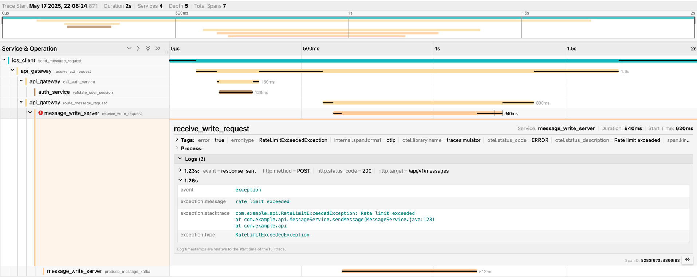

# Trace Simulation Receiver

<!-- status autogenerated section -->

| Status      |                                      |
|-------------|--------------------------------------|
| Stability   | [alpha]: traces                      |
| Code Owners | [@k4ji](https://www.github.com/k4ji) |

[alpha]: https://github.com/open-telemetry/opentelemetry-collector/blob/main/docs/component-stability.md#alpha

---

## Overview

The **Trace Simulation Receiver** generates synthetic trace data for testing, validating, and benchmarking
OpenTelemetry-compatible pipelines.

It simulates traces based on configurable blueprints, enabling teams to replicate distributed system behavior—including
service interactions, span timing, span linking and error conditions—without instrumenting real services.

The blueprint configuration is shown below.
The `service` blueprint is service-based: each service can have multiple span definitions.
This blueprint describes a trace that spans multiple services, simulating client-server-producer interactions with
realistic delays and probabilistic failures (e.g., 20% chance of error injection).

<details><summary>Click to expand the full blueprint example</summary>

```yaml
receivers:
  tracesimulationreceiver:
    global:
      interval: 5s
    blueprint:
      type: service
      service:
        default:
          delay:
            for: "0.05"
            as: relative
          duration:
            for: "0.8"
            as: relative
        services:
          - name: ios_client
            resource:
              service.version: v3
            spans:
              - name: send_message_request
                ref: ios_send_message_request
                kind: client
                delay:
                  for: 0s
                  as: absolute
                duration:
                  for: 2s
                  as: absolute

          - name: api_gateway
            spans:
              - name: receive_api_request
                ref: api_receive_api_request
                kind: server
                parent: ios_send_message_request
                children:
                  - name: call_auth_service
                    ref: call_auth_service
                    kind: client
                    duration:
                      for: "0.1"
                  - name: route_message_request
                    ref: route_message_request
                    kind: client
                    delay:
                      for: "0.3"
                    duration:
                      for: "0.5"

          - name: auth_service
            spans:
              - name: validate_user_session
                kind: server
                parent: call_auth_service

          - name: message_write_server
            spans:
              - name: receive_write_request
                kind: server
                events:
                  - name: response_sent
                    delay:
                      for: "0.95"
                      as: relative
                    attributes:
                      http.method: POST
                      http.target: /api/v1/messages
                      http.status_code: "200"
                conditionalEffects:
                  - condition:
                      kind: probabilistic
                      probabilistic:
                        threshold: 0.2
                    effects:
                      - kind: markAsFailed
                        markAsFailed:
                          message: Rate limit exceeded
                      - kind: annotate
                        annotate:
                          attributes:
                            error.type: RateLimitExceededException
                      - kind: recordEvent
                        recordEvent:
                          event:
                            name: exception
                            delay:
                              for: "1.0"
                              as: relative
                            attributes:
                              exception.message: rate limit exceeded
                              exception.type: RateLimitExceededException
                              exception.stacktrace: |
                                com.example.api.RateLimitExceededException: Rate limit exceeded
                                at com.example.api.MessageService.sendMessage(MessageService.java:123)
                                at com.example.api
                parent: route_message_request
                children:
                  - name: produce_message_kafka
                    ref: produce_message_kafka
                    kind: producer
                    attributes:
                      messaging.system: kafka
                      messaging.destination: message-topic
                      messaging.operation: publish
```

</details>

The configuration above produces a trace like the one shown below (visualized using Jaeger):


---

## Use Cases

- Benchmarking OpenTelemetry pipeline performance
- Testing OpenTelemetry-compatible backends such as Datadog, Dynatrace, Jaeger, Honeycomb, New Relic, and Splunk (listed
  alphabetically)
- Demonstrating trace correlation and visualization tools

---

## Getting Started

### macOS and Linux (arm64)

1. **Start Jaeger** (with OTLP enabled):

```shell
docker run --rm --name jaeger \
  -e COLLECTOR_OTLP_ENABLED=true \
  -p 16686:16686 \
  -p 4317:4317 \
  -p 4318:4318 \
  jaegertracing/all-in-one:1.69.0
```  

2. Run the OpenTelemetry Collector with Trace Simulation Receiver (example config files are included in the provided
   image):

```shell
docker run --rm \
  ghcr.io/k4ji/otelcol-tracesimulationreceiver:v0.4.1 \
  --config /etc/otelcol/example/complex.yaml
 ```

3. View the traces in Jaeger UI
   Open http://localhost:16686 in your browser.

You can also explore other simulation scenarios using the configurations in [`./example`](./example) as well.

### Building Locally

1. Clone [otelcol-tracesimulationreceiver](https://github.com/k4ji/otelcol-tracesimulationreceiver) repository to build
   the Docker image of the opentelemetry collector with the
   trace simulation receiver:

```shell
git clone https://github.com/k4ji/otelcol-tracesimulationreceiver.git
cd otelcol-tracesimulationreceiver
```

2. Build the Docker image (from the root of the repository):

```shell
docker build -t your-image-name . 
```

3. Follow the same steps from the macOS/Linux section above, starting with Step 1 (Jaeger setup) with the image you
   built in Step 2.

---

## Configuration

Refer to the [reference configuration](./reference.yaml) for detailed options, and see
the [examples directory](./example) for real-world usage patterns.

---

## Tutorials

[docs/tutorial.md](./docs/tutorial.md) helps you quickly get started with the `TraceSimulationReceiver` by walking through how to generate synthetic traces using features like:
- Interval control
- Span timing and relationships
- Attributes and events
- Conditional effects for failures and annotations

---

## Stability

This receiver is currently in **alpha** and may undergo breaking changes.

## License

Licensed under the [Apache 2.0 License](./LICENSE).